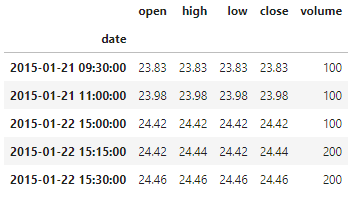
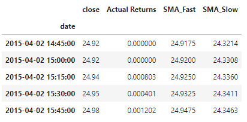
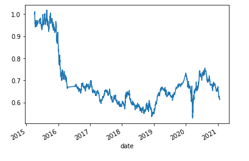
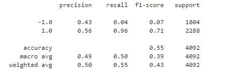
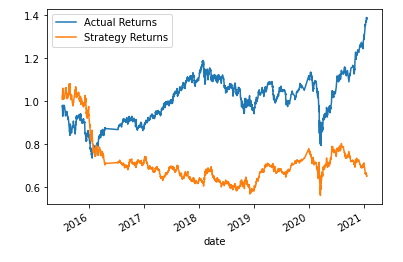

# Mod14_Challenge: Machine Learning Trading Bot

# Overview
For the benefit of our financial advisory firm, this analysis uses machine learning algorithms to 
make recommendations for stock buying and selling. In a competitive advantage, this analysis
can incorporate new data and make recommendations based on trading signals.

The bot is programmed with short and long window SMA values to create trading signals.
It uses the SVC classifier model from SKLearn's support vector machine (SVM) learning method in
the initial model.
It uses the Logistic Regression from SKLearn to also test the model.

# Results

The SVC Classifier Model had an accuracy of .55. The Logistic Regression model had an accuracy of .52.
Neither model was particularly good.

# Data
'''
ohlcv_df = pd.read_csv(
    Path("./Resources/emerging_markets_ohlcv.csv"), 
    index_col='date', 
    infer_datetime_format=True, 
    parse_dates=True
)
'''

# Libraries and Imports

'''
# Imports
import pandas as pd
import numpy as np
from pathlib import Path
import hvplot.pandas
import matplotlib.pyplot as plt
from sklearn import svm
from sklearn.preprocessing import StandardScaler
from pandas.tseries.offsets import DateOffset
from sklearn.metrics import classification_report

from sklearn.linear_model import LogisticRegression

'''

# Output
The initial dataset was reduced to signals_df with the Date, Close and Actual Returns.

Generated trading signals using short- and long-window SMA values.
short = 4
long= 100

Created a signal to buy when returns were up and sell when returns were down

 

# Created By
Ann Howell with support from Rice University FinTech Bootcamp

# License
MIT